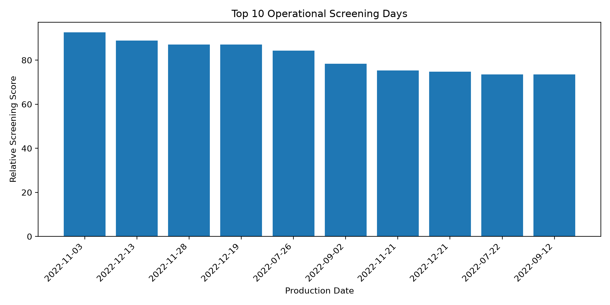
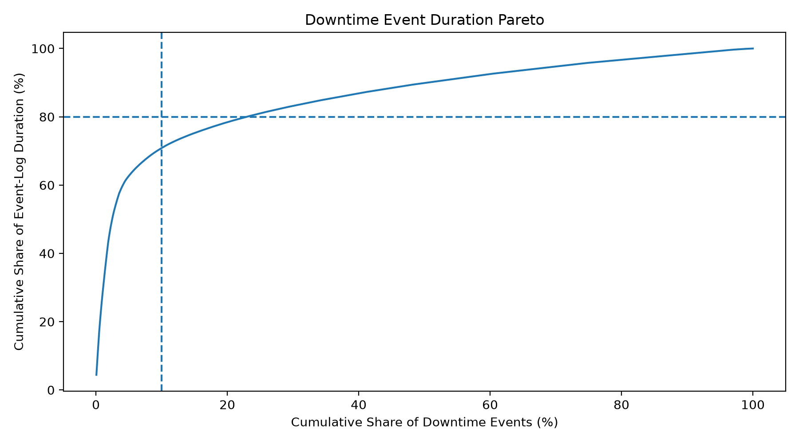
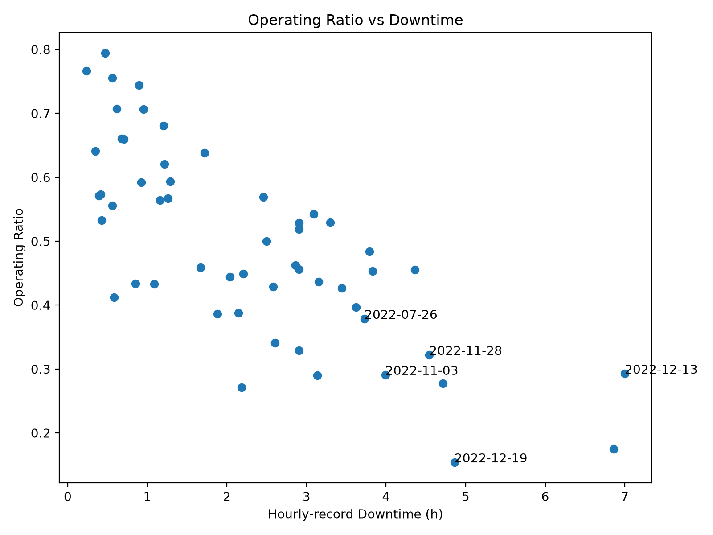

# Production Management AI

생산 데이터를 기반으로 **KPI 계산 → 데이터 검증 → 이상/손실 탐지 → 운영 우선순위 선정 → LLM 보고**까지 연결하는 생산관리 의사결정 지원 프로젝트입니다.

핵심 원칙은 다음과 같습니다.

> **Calculation by Python → Validation by Rules → Interpretation by LLM**

LLM이 정량 지표를 직접 계산하거나 존재하지 않는 Root Cause를 생성하지 않도록 역할을 분리했습니다.

---

## V3 — Evidence-Grounded Multi-Agent Production Analysis

V3 extends the verified V2 analysis into a multi-agent
decision-support structure.

The goal is not to let multiple LLMs independently guess
root causes. Instead, Python first generates deterministic
evidence packages, and each specialist agent analyzes only
its assigned evidence.

### Architecture

```text
Verified Manufacturing Data
            │
            ▼
     Python Evidence Layer
            │
     ┌──────┼──────┬──────┐
     ▼      ▼      ▼      ▼
Production Downtime Efficiency Pattern
  Agent      Agent     Agent    Agent
     └──────┴──────┬──────┘
                   ▼
          Production Manager
                   │
                   ▼
        Production Action Report

# V2 — Real Manufacturing Data Analysis

V1에서 검증한 분석 구조를 실제 공개 산업 생산데이터로 확장했습니다.

### Dataset Scale

- Daily production records: **59**
- Hourly operation records: **265**
- Downtime events: **1,388**
- Production period: **2022-07-22 ~ 2023-02-10**

분석 흐름:

**Raw Industrial Data → Data Validation → Canonical Dataset → KPI Analysis → Operational Screening → Downtime Pareto**

---

## 1. Data Quality Validation

실제 데이터를 바로 분석하지 않고 먼저 테이블 간 정합성을 검증했습니다.

주요 발견:

- Downtime Event의 잘못된 연도 데이터 **18건 검출 및 보정**
- Missing hourly production date **1건**
- Potential event-log gap **1건**
- Pause-definition mismatch **15건**
- Multi-product daily records **6건**

검증되지 않은 값은 임의 수정하지 않고 Data Quality Flag로 유지했습니다.

---

## 2. Operational Screening

운영 Loss를 다음 세 관점으로 분석했습니다.

- Operating Loss
- Hourly-record Downtime
- Downtime Event Frequency

각 지표의 percentile rank를 동일 가중치로 결합해 **Relative Screening Score**를 구성했습니다.

> Screening Score는 실제 기업의 Control Limit가 아니라  
> 데이터 내에서 우선 검토할 생산일을 찾기 위한 상대적 지표입니다.

### Top Screening Results

| Rank | Date | Product | Operating Ratio | Downtime (h) | Events | Score |
|---|---|---:|---:|---:|---:|---:|
| 1 | 2022-11-03 | 3L | 0.2907 | 3.9910 | 67 | 92.59 |
| 2 | 2022-12-13 | 5L | 0.2926 | 6.9991 | 36 | 88.89 |
| 3 | 2022-11-28 | 3L | 0.3220 | 4.5419 | 46 | 87.04 |
| 4 | 2022-12-19 | 5L | 0.1538 | 4.8586 | 25 | 87.04 |
| 5 | 2022-07-26 | 3L | 0.3785 | 3.7292 | 50 | 84.26 |



---

## 3. Downtime Pareto Analysis

총 **1,388건**의 Downtime Event를 지속시간 기준으로 분석했습니다.

### Key Result

**상위 약 10%의 장시간 Event가 전체 Event-log Duration의 70.87%를 차지했습니다.**

| Event Group | Event Share | Duration Share |
|---|---:|---:|
| Short ≤ P50 | 50.07% | 10.13% |
| Medium P50–P90 | 39.91% | 19.01% |
| Long ≥ P90 | 10.01% | **70.87%** |

추가 결과:

- P90 Duration: **6.50 min**
- P95 Duration: **13.74 min**
- P99 Duration: **106.84 min**
- 전체 Event의 약 **2.5%인 35건**이 Duration의 50%를 설명
- **319건**이 Duration의 80%를 설명

따라서 Event 발생 횟수만 관리하기보다 **장시간 정지가 전체 Loss에 미치는 영향**을 별도로 관리할 필요가 있음을 확인했습니다.



---

## 4. Statistical Outlier ≠ Operational Priority

IQR 기반 이상치와 운영 우선순위를 분리했습니다.

### IQR Limits

- Operating Ratio lower limit: **0.1103**
- Downtime upper limit: **6.4977 h**
- Event Count upper limit: **68.5**

Statistical Outlier는 총 **3일**이었습니다.

그러나 Screening Rank 1위인 `2022-11-03`은 통계적 Outlier가 아니었습니다.

즉,

**통계적으로 극단적인 값과 운영상 먼저 확인해야 할 대상은 반드시 동일하지 않습니다.**



---

## 5. Product-Level Observation

복수 제품 생산일을 제외하고 Single-product day만 비교했습니다.

| Product | Records | Median Operating Ratio | Mean Operating Ratio |
|---|---:|---:|---:|
| 3L | 36 | 0.4751 | 0.4936 |
| 5L | 17 | 0.4274 | 0.4162 |

5L 생산 기록에서 Operating Ratio가 상대적으로 낮게 관찰됐지만,  
현재 데이터만으로 제품 크기가 직접적인 원인이라고 판단하지 않았습니다.

---

## 6. V2 Key Findings

### Long-duration Loss Concentration
Downtime Event의 약 **10%가 전체 Event-log Duration의 약 71%**를 차지했습니다.

### Frequency and Duration Should Be Separated
정지 빈도가 높은 날과 장시간 정지가 발생한 날은 반드시 동일하지 않았습니다.

### Data Quality Before Decision
결측 데이터가 있는 생산일을 Ranking에서 제외하지 않을 경우 잘못된 우선순위가 생성될 수 있음을 확인했습니다.

### Root Cause Was Not Invented
현재 데이터에는 설비 고장 코드, 작업자, 자재, Cycle Time 등의 정보가 없기 때문에 Root Cause를 확정하지 않았습니다.

목표는 원인을 임의 생성하는 것이 아니라,

**Issue Detection → Priority Screening → Recommended Next Check**

까지 지원하는 것입니다.

📄 [Full V2 Production Analysis Report](results/v2_production_report.md)

---

# V1 — Baseline Architecture

V1은 self-created synthetic production dataset을 이용해 분석 구조를 먼저 검증한 단계입니다.

### Pipeline

**Production Data → Python KPI Calculation → Rule-based Exception Detection → Repeated Loss Analysis → LLM Reporting**

### Result

- Production records: **20**
- Detected exceptions: **8**
- B200 Low Schedule Attainment: **3 occurrences → HIGH**
- C300 High Defect Rate: **2 occurrences → MEDIUM**

LLM에게 KPI 계산과 관리기준 판정을 맡기지 않고 역할을 분리했습니다.

| Component | Role |
|---|---|
| Python | KPI calculation |
| Rule | Exception detection |
| LLM | Interpretation & reporting |

> V1 데이터는 architecture validation을 위해 직접 구성한 synthetic dataset입니다.

---

# Repository Structure

```text
production-management-ai/
│
├── data/
│   ├── sample_production_data.csv
│   └── processed/
│
├── src/
│   ├── calculate_kpi.py
│   ├── detect_exceptions.py
│   ├── analyze_repeated_loss.py
│   ├── generate_report.py
│   ├── inspect_real_data.py
│   ├── validate_real_data.py
│   ├── investigate_real_anomalies.py
│   ├── build_v2_dataset.py
│   ├── analyze_v2_operations.py
│   └── analyze_v2_pareto.py
│
├── results/
│   ├── figures/
│   ├── v2_daily_kpi_screening.csv
│   ├── v2_product_comparison.csv
│   ├── v2_outlier_days.csv
│   └── v2_production_report.md
│
├── README.md
└── requirements.txt
```

---

# Tech Stack

`Python` `pandas` `NumPy` `matplotlib` `OpenAI API` `openpyxl`

---

# Roadmap

### V1 — Rule-based Baseline ✅

Synthetic production scenario

- KPI calculation
- Exception detection
- Repeated Loss analysis
- LLM reporting

### V2 — Real Manufacturing Data ✅

Public industrial manufacturing data

- Data quality validation
- Cross-table reconciliation
- Operational KPI analysis
- Relative screening
- Downtime Pareto
- Visualization

### V3 — Multi-Agent Production Management 🚧

Next development:

- Production Agent
- Downtime Agent
- Efficiency Agent
- Pattern Agent
- Production Manager Agent

각 Agent는 원시 데이터를 임의로 계산하는 대신  
**Python이 생성한 검증된 Evidence를 서로 다른 생산관리 관점에서 분석**하도록 설계할 예정입니다.